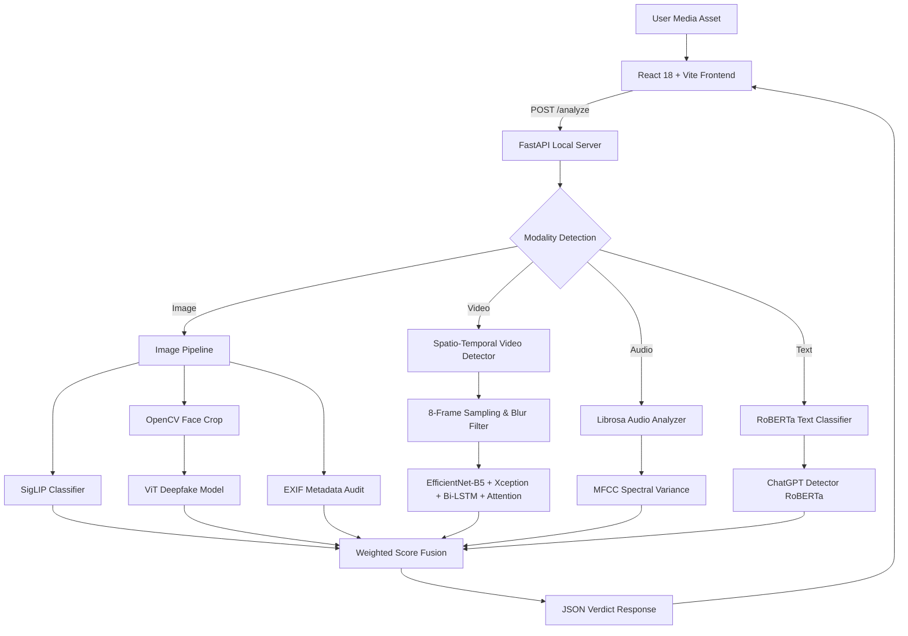

# Veritas Neural

### *Multimodal AI Forensics & Deepfake Detection Engine*

[](https://veritas-neural.vercel.app)

[](https://python.org)
[](https://fastapi.tiangolo.com)
[](https://pytorch.org)
[](https://react.dev)
[](https://vitejs.dev)
[](LICENSE)

---

## 🌐 Live Application

🚀 **Experience Veritas Neural Live:** [**https://veritas-neural.vercel.app**](https://veritas-neural.vercel.app)

---

## 🧠 Overview

**Veritas Neural** is an advanced, multi-modal forensic inference engine designed to analyze **Images**, **Videos**, **Audio**, and **Text** for synthetic manipulation and AI generation. 

Built on a **Zero-Trust, Local-First** philosophy, Veritas Neural executes neural network inference directly on local hardware (CPU/CUDA) via PyTorch and Hugging Face Transformers. No media assets leave your machine during local operation, delivering complete privacy and instant verification.

---

## ✨ Key Features

- **🛡️ Multi-Modal Forensic Analysis:** Unified detection pipeline for Text, Image, Audio, and Video assets.
- **🔌 Local-First Privacy Architecture:** Fully self-hosted backend. PyTorch models run locally with zero cloud API dependencies.
- **🎬 3D Spatio-Temporal Video Deepfake Engine:** Combines **EfficientNet-B5 + Xception** spatial fusion with a **Bi-LSTM** sequence model and **Temporal Attention** mechanism across 8-frame sparse sampling.
- **🖼️ Image Dual-Model Ensemble:** Uses **SigLIP** (`ai-vs-human-image-detector`) for full-canvas evaluation combined with a **ViT Deepfake Classifier** for facial crop analysis.
- **📄 RoBERTa Linguistic Analysis:** Transformers-driven text classification to detect AI-generated text and LLM prose signatures.
- **🎙️ MFCC Audio Spectral Inspection:** Extracts spectral variance and Mel-Frequency Cepstral Coefficients (MFCC) using `librosa`.
- **📋 EXIF Metadata Audit:** Extracts camera make, model, software, and timestamp indicators using `exifread`.
- **🎨 Cybernetic 3D Dashboard:** A dark "Midnight Luxe" web interface built with React, Vite, GSAP 3, Tailwind CSS, Lucide React, and Spline 3D visuals.

---

## 🏗️ System Architecture



---

## 🧪 Tech Stack

### Backend
- **Framework:** FastAPI
- **Server:** Uvicorn
- **AI/ML Engine:** PyTorch, Hugging Face Transformers, `timm`
- **Video Model:** Custom EfficientNet-B5 + Xception + Bi-LSTM + Temporal Attention
- **Computer Vision:** OpenCV (`opencv-python-headless`), Pillow
- **Audio Processing:** Librosa, SoundFile
- **Metadata Extraction:** ExifRead

### Frontend
- **Framework:** React 18, Vite
- **Animations:** GSAP 3 (ScrollTrigger), Framer Motion
- **3D Engine:** `@splinetool/react-spline`
- **Styling:** Tailwind CSS v3.4, Custom Glassmorphism UI
- **Icons:** Lucide React

---

## 📁 Repository Structure

```text
majorproject/
├── main.py                     # FastAPI application & multi-modal routing engine
├── requirements.txt            # Python backend dependencies
├── Dockerfile                  # Container definition for local/cloud deployment
├── models/
│   └── README.md               # Model checkpoint placement guide (best_spatiotemporal_model.pth)
├── video_detector/             # Spatio-Temporal Video Deepfake Engine
│   ├── __init__.py
│   ├── model.py                # Dual-backbone (EfficientNet-B5 + Xception) + Bi-LSTM + Attention architecture
│   ├── preprocessing.py        # Frame sampling & tensor normalization
│   └── inference.py            # Video model loader & sequence predictor
└── frontend/                   # React + Vite Web Application
    ├── src/
    │   ├── App.jsx             # Single-page application & forensic dashboard
    │   └── index.css           # Design tokens, keyframes & noise overlay
    ├── package.json
    ├── vite.config.js
    └── .env                    # Environment configuration (VITE_API_URL)
```

---

## ⚙️ Installation & Setup

### Prerequisites
- **Python:** 3.10 or higher
- **Node.js:** 18 or higher

### 1. Clone the Repository
```bash
git clone https://github.com/1SoulHunter1/veritas-neural.git
cd veritas-neural
```

### 2. Backend Setup
```bash
# Install Python dependencies
pip install -r requirements.txt

# Start the FastAPI inference server
python main.py
```
> **Note:** On first startup, Hugging Face models will automatically cache to your local machine (~800MB).

### 3. Frontend Setup
Open a new terminal window:
```bash
cd frontend

# Install Node dependencies
npm install

# Start the Vite development server
npm run dev
```

Visit **`http://localhost:5173`** in your browser.

---

## 🔑 Environment Variables

### Frontend (`frontend/.env`)
```env
VITE_API_URL=http://127.0.0.1:8000
```

### Backend (Optional System Environment Variables)
```env
ALLOWED_ORIGINS=http://localhost:5173,http://localhost:3000
PORT=8000
```

---

## 📡 API Reference

### `GET /health`
Returns system operational status, loaded models, and active device execution.

**Example Response:**
```json
{
  "status": "operational",
  "engine": "v11.0",
  "torch": true,
  "primary_model": "Ateeqq/ai-vs-human-image-detector",
  "primary_ready": true,
  "secondary_model": "prithivMLmods/Deep-Fake-Detector-v2-Model",
  "secondary_ready": true,
  "text_model": "Hello-SimpleAI/chatgpt-detector-roberta",
  "text_ready": true,
  "verdict_threshold": 65
}
```

---

### `POST /analyze`
The primary endpoint for file and text analysis.

#### Parameters (Form Data):
| Parameter | Type | Required | Description |
| :--- | :--- | :--- | :--- |
| `file` | `UploadFile` | Optional | Binary file asset (Image: `.jpg`/`.png`/`.webp`, Video: `.mp4`/`.avi`/`.mov`, Audio: `.wav`/`.mp3`, Text: `.txt`) |
| `text_payload` | `string` | Optional | Raw text string for linguistic analysis |

#### Example Response (Image Scan):
```json
{
  "success": true,
  "scan_id": "0xa3f192b4",
  "filename": "sample_image.jpg",
  "modality": "image",
  "classification": "SYNTHETIC",
  "verdict": "SYNTHETIC",
  "score": 87,
  "confidence": "HIGH",
  "processing_time_ms": 420.5,
  "latency": "0.421s",
  "model": "Ateeqq/ai-vs-human-image-detector",
  "evidence": [
    {
      "name": "SigLIP AI Image Classifier",
      "status": "active",
      "source": "Ateeqq/ai-vs-human-image-detector",
      "details": "AI probability: 88.5%"
    }
  ],
  "score_fusion": {
    "method": "Weighted combination of available model outputs",
    "components": [
      { "name": "SigLIP classifier", "weight": "70%" }
    ]
  }
}
```

---

## 🧬 AI Models & Forensics Catalog

| Modality | Model / Architecture | Repository / Technique | Purpose |
| :--- | :--- | :--- | :--- |
| **Image (Primary)** | SigLIP Vision Transformer | `Ateeqq/ai-vs-human-image-detector` | Full-image synthetic content detection |
| **Image (Face)** | ViT Image Classification | `prithivMLmods/Deep-Fake-Detector-v2-Model` | Face crop deepfake evaluation |
| **Video** | EfficientNet-B5 + Xception + Bi-LSTM + Attention | Custom (`video_detector/model.py`) | Spatio-temporal frame sequence detection |
| **Text** | RoBERTa Transformer | `Hello-SimpleAI/chatgpt-detector-roberta` | Synthetic prose & LLM output detection |
| **Audio** | Librosa MFCC Analysis | Spectral Variance Extraction | Acoustic signal variance inspection |
| **Metadata** | ExifRead | Camera Tag Audit | Capture EXIF metadata presence check |

---

## 🐳 Docker Deployment

The backend is fully containerized and compatible with local Docker or cloud deployment platforms like Hugging Face Spaces:

```bash
# Build the Docker image
docker build -t veritas-neural-core .

# Run container on port 7860
docker run -p 7860:7860 veritas-neural-core
```

---

## 📜 License

Distributed under the **MIT License**. See `LICENSE` for details.

---

<p align="center">
  Crafted with ❤️ by <b>RahulRathod</b>
</p>
