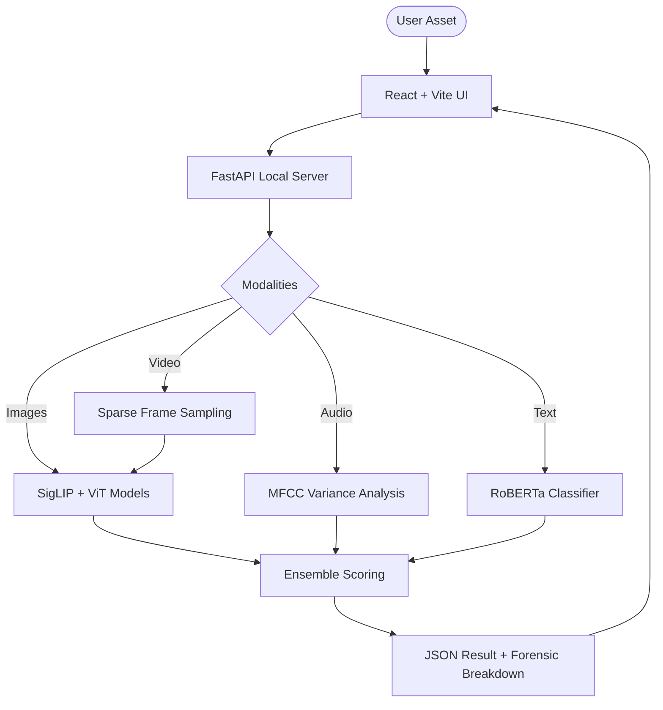

# Veritas Neural

### *The Final Bastion of Authenticity in a Synthetic World.*

---

## 🧠 Overview

**Veritas Neural** is a world-class, multi-modal forensic engine designed to dismantle the threat of AI-generated misinformation. While most deepfake detectors rely on opaque cloud processing, Veritas Neural operates on a **Zero-Trust, Local-First** architecture. 

By executing complex neural inference directly on the user's hardware, we ensure that sensitive data never leaves the device. Whether it's a suspicious voice clone, a manipulated video, or synthetically generated text, Veritas Neural provides an immediate, verifiable, and private verdict.

---

## ✨ Key Features

- **🛡️ Multi-Modal Detection:** Comprehensive analysis of Text, Image, Audio, and Video in a single unified pipeline.
- **🔌 Local-First Inference:** High-performance PyTorch models execute on-device (CPU/CUDA). No cloud uploads. No data leaks.
- **⚡ Proactive Forensics:** Detects GAN boundary anomalies, PRNU sensor noise mismatches, and MFCC voice-clone signatures.
- **🎨 Cinematic UI:** A premium 3D experience powered by **React Three Fiber (Spline)** and **GSAP** for intentional, weighted interactions.
- **📉 Privacy-Focus:** Fully operational offline after the initial model download (~800MB cache).

---

## 🏗️ Architecture

Veritas Neural is built for speed and privacy. The data flow is strictly unidirectional and local:



---

## 🧪 Tech Stack

### Frontend
- **Core:** React 19, Vite
- **Animations:** GSAP 3 (ScrollTrigger), Framer Motion
- **3D Engine:** Spline (React-Spline)
- **Icons:** Lucide React
- **Styling:** Tailwind CSS v3.4

### Backend
- **Framework:** FastAPI
- **Server:** Uvicorn (Standard)
- **Image Processing:** OpenCV, Pillow
- **Audio Processing:** Librosa, SoundFile
- **Metadata:** ExifRead

### AI/ML
- **Engine:** PyTorch / Transformers (Hugging Face)
- **Inference:** Local CPU/CUDA execution

---

## ⚙️ Installation & Setup

### Prerequisites
- Python 3.10+
- Node.js 18+

### 1. Clone the Repository
```bash
git clone https://github.com/1SoulHunter1/veritas-neural-core.git
cd veritas-neural-core
```

### 2. Backend Setup
```bash
# Install dependencies
pip install -r requirements.txt

# Launch the inference engine
python main.py
```
*Note: Models (~800MB) will download automatically on the first run.*

### 3. Frontend Setup
```bash
cd frontend
npm install
npm run dev
```

---

## 🔑 Environment Variables

Create a `.env` file in the `frontend` directory:

```env
VITE_API_URL=http://localhost:8000
```

---

## 📡 API Endpoints

### `POST /api/analyze`
The primary endpoint for multi-modal analysis.

| Parameter | Type | Description |
| :--- | :--- | :--- |
| `file` | File (Binary) | The media asset to analyze (Optional if text is provided) |
| `text_payload` | String | Plain text for linguistic analysis (Optional if file is provided) |

**Example Response:**
```json
{
  "scan_id": "0x99a2b3c4",
  "filename": "deepfake_sample.mp4",
  "latency": "1.42s",
  "score": 88,
  "verdict": "SYNTHETIC",
  "breakdown": {
    "visual": 88,
    "audio": 82,
    "linguistic": 0
  },
  "anomalies": [
    { "id": 1, "label": "GAN Boundary Anomaly", "severity": "CRITICAL" },
    { "id": 2, "label": "Temporal AI Confidence Flicker", "severity": "HIGH" }
  ],
  "timeline_spikes": ["0:12", "0:22"]
}
```

---

## 🖥️ Usage Guide

1. **Upload:** Drag and drop any media asset into the "Scanner" interface.
2. **Analyze:** Click "Run Detection". PyTorch models will execute sparse frame sampling and spectral analysis.
3. **Inspect:** View the "Forensic Timeline" to see exactly where AI manipulation was detected.
4. **Verdict:** Receive a definitive `AUTHENTIC` or `SYNTHETIC` status with a detailed anomaly breakdown.

---

## 📸 Screenshots / UI Preview

> [!TIP]
> **View the Cinematic Dashboard**

| Landing Page | Forensic Scanner | Results Breakdown |
| :---: | :---: | :---: |
|  |  |  |

---

## 🧬 AI Models Used

Veritas Neural utilizes an ensemble of state-of-the-art models for maximum accuracy:

- **🖼️ SigLIP (Image):** `Ateeqq/ai-vs-human-image-detector`. Optimized for identifying the subtle patterns in AI-generated photographic content.
- **👤 ViT Deepfake (Face):** `prithivMLmods/Deep-Fake-Detector-v2-Model`. Focused on face-swap and facial manipulation detection via individual frame crops.
- **🎙️ MFCC Audio Forensics:** Custom spectral variance analysis using `Librosa` to detect patterns unique to vocoders and neural TTS engines.
- **📄 RoBERTa (Text):** `Hello-SimpleAI/chatgpt-detector-roberta`. A heavy-lifting transformer model trained to distinguish human prose from LLM (GPT-4, Claude) output.

---

## 🔐 Privacy & Design Philosophy

**Privacy is not a feature; it is our foundation.**
- **Local Sovereignty:** We believe your data should never leave your device. Veritas Neural runs fully air-gapped if needed.
- **Hardware Agnostic:** Optimized for both CUDA (NVIDIA) and standard CPU processing.
- **Verification over Trust:** We provide the underlying signals (EXIF, MFCC, GAN tells) so the result is explainable, not just a black-box score.

---

## 🚀 Deployment

### Frontend (Vercel)
The React application is optimized for Vercel deployment. Ensure `VITE_API_URL` points to your active backend instance.

### Backend (Hugging Face Spaces / Docker)
The backend is Docker-ready. For high-availability, we recommend hosting on Hugging Face Spaces with a persistent storage volume for model caching.

```bash
docker build -t veritas-neural-core .
docker run -p 7860:7860 veritas-neural-core
```

---

## 🧩 Future Improvements

- [ ] **Multi-GPU support** for ultra-fast batch processing.
- [ ] **browser extension** for real-time social media content verification.
- [ ] **PDF Forensic Reports** for legal and journalistic documentation.
- [ ] **Blockchain Provenance** integration for immutable verification logs.

---

## 🤝 Contributing

We welcome contributions from forensic researchers and ML engineers. Please open an issue or submit a pull request with detailed documentation of your proposed changes.

---

## 📜 License

Distributed under the **MIT License**. See `LICENSE` for more information.

---

<p align="center">
  Built with 🔴 by 1SoulHunter1
</p>
